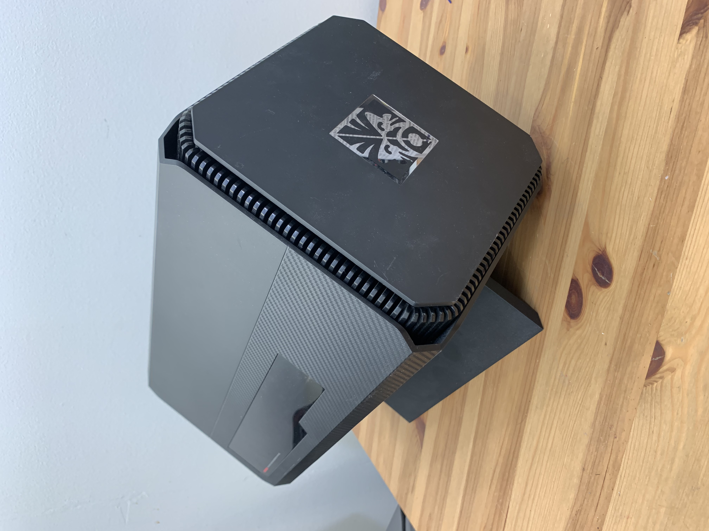
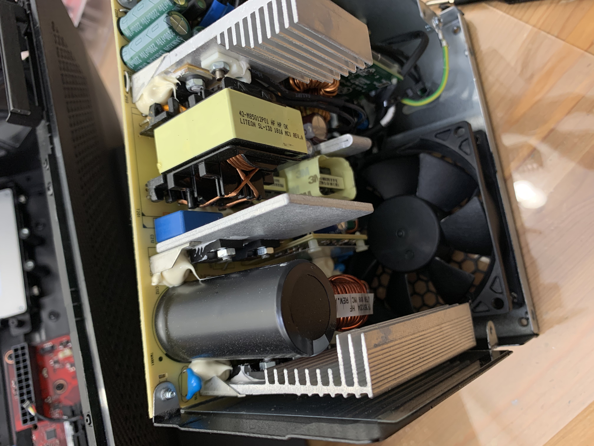
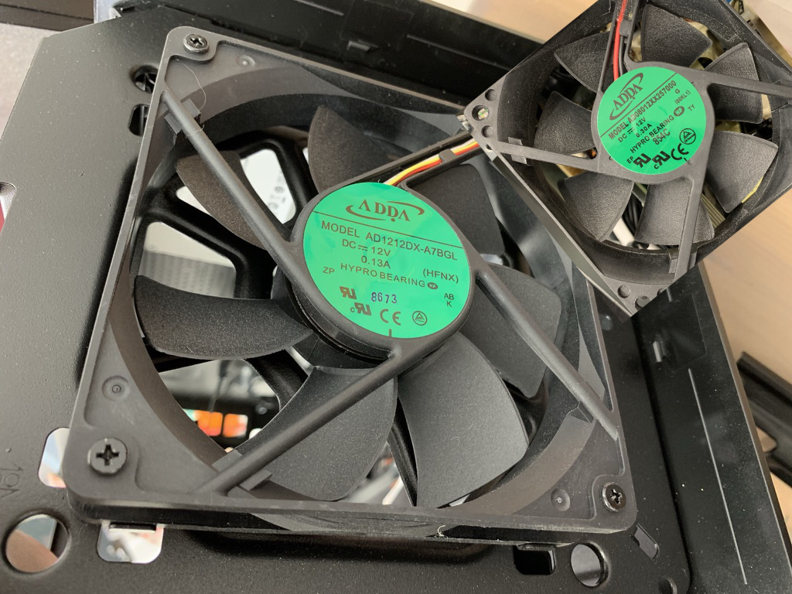
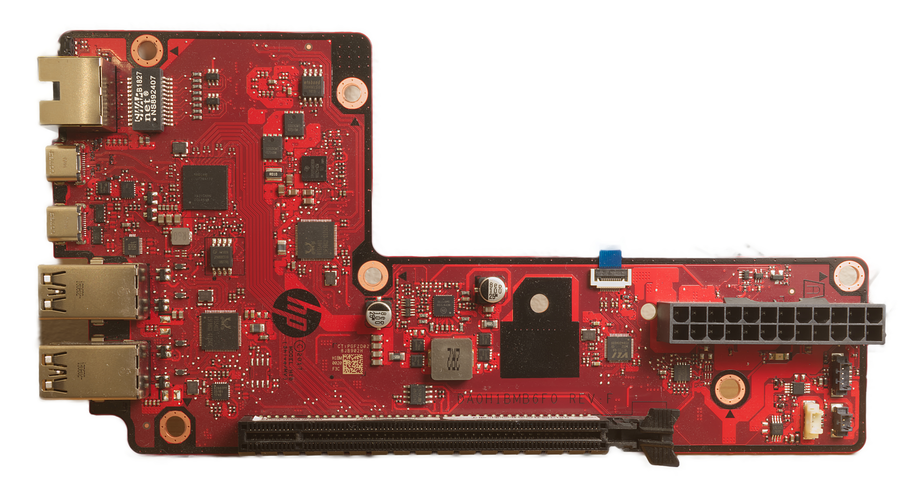
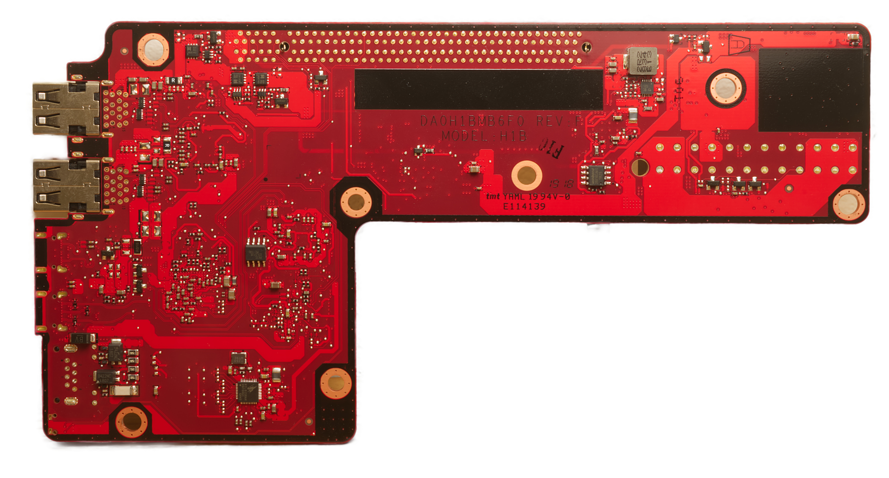

# HP Omen Accelerator eGPU
HP Omen Accelerator eGPU Information.

## Basic Information

The HP Omen Accelerator is a Thunderbolt 3 eGPU enclosure. Its port selection makes it suitable for use as a docking station. The device is rather large, and takes up space in part because it is mounted on a corner. The cover can be opened without tools, but a flat head or Philips screwdriver (must have a long, thin shaft) is needed to fasten the GPU screw.

## Dimensions and Ports

Dimensions:

| Dimension      | Value                                                   |
| -------------- | ------------------------------------------------------- |
| Height         | ~27cm                                                   |
| Width          | ~27cm                                                   |
| Length         | ~40cm                                                   |
| GPU Max Length | 29 cm (from eGPU.io); can be made longer if remove LEDs |

Ports:

| Port                       | Number | Works on macOS Big Sur? |
| -------------------------- | ------ | ----------------------- |
| USB 3.0 Type A             | 4      | Yes                     |
| USB-C SuperSpeed           | 1      | Yes                     |
| SATA (via USB bridge)      | 1      | Yes                     |
| Gigabit Ethernet (Realtek) | 1      | Yes                     |
| Thunderbolt 3 (To Host)    | 1      | Yes, 60W                |

## Power and Cooling

The HP Omen Accelerator uses a 500w Lite-On ATX power supply. The length is important, as longer power supplies obstruct the ATX connector on the mainboard. The power supply has Active PFC, and is 80 Plus certified. A lot of the heat from the power supply is actually from the GPU.

### Don't disassemble the power supply unless you know what you are doing. This is for information only. Proceed at your own risk. Do not touch, and discharge the large filter capacitors before touching anything.

The power supply and case fans are shown below.

The fan on the front of the case is ineffective. The side air intakes are blocked by a restrictive metal grille and the HP Omen logo plate on the front (removable) still obstructs airflow to a large extent. 

Power supply fan is somewhat loud at idle, and the case fan is inaudible. It [the case fan] is capable of becoming very loud and noisy, has a proprietary connector, and is PWM controlled. It clicks at anything above low speed. The power supply fan is thermally controlled, but has a high minimum speed. 

Replacement of this fan with a quiet one is unrecommended as it is an important source of case ventilation. If you have one of these, either keep the cover off, or improve the ventilation before changing all the fans if quietness and/or cooling is important to you. 

## Power Consumption

The laptop (Apple MacBook Pro 16" 2019) was plugged into the official AC adapter while running these tests. Because the computer will always choose the most powerful adapter, and this is only 60W, the computer is not taking power from the docking station.

| Scenario                                                     | Power (Real) | Power Factor |
| ------------------------------------------------------------ | ------------ | ------------ |
| Unplugged from computer (PSU always runs)                    | 7.9W         | 0.5          |
| Computer plugged in, no GPU                                  | 12.3W        | 0.67         |
| Computer unplugged, MSI RX570 4GB GAMING X installed         | 24.4W        | 0.84         |
| Computer plugged in, MSI RX570 4GB GAMING X installed        | 29.4W        | 0.89         |
| Computer plugged in, MSI RX570 4GB GAMING X installed, 4K60 desktop output | 33W          | 0.94         |
| Unigine Valley 2560x1440 Max Settings                        | 150W         | 0.97         |

This graphics enclosure will use significant power when not connected or in use. Turn it off using a power bar to save energy.

## Board Photos

Front:

Back:

## Questions, Additions, and Comments

Feel free to add questions or content you think was missed, and I'll see if I can add it. You can open an "Issue" on this GitHub repo and I'll see what I can do.

I no longer have this hardware. You can still request information, but I may not be able to obtain it for you.